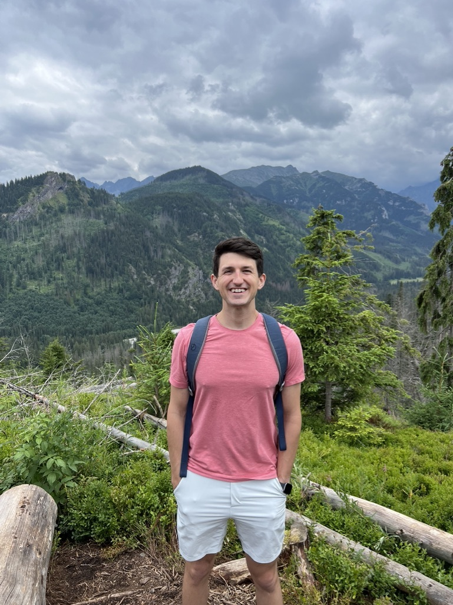

Hi! My name is Michael Denham. I'm a fourth year medical student at Columbia University.

I received my BS in Chemical Engineering and BA in Economics from Louisiana State University and hold an MPhil in Health, Medicine, and Society from the University of Cambridge.

My research interests include the relationship between hearing loss and dementia, music perception, market consolidation within otolaryngology, and surgical ethics. 

In my free time, I enjoy playing piano and guitar, writing journalistic articles and fiction, traveling, and exploring New York's vibrant theater scene. 

